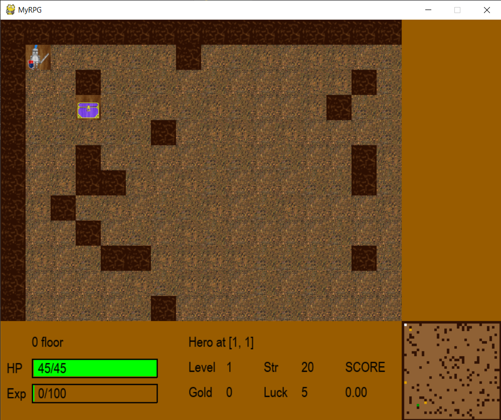
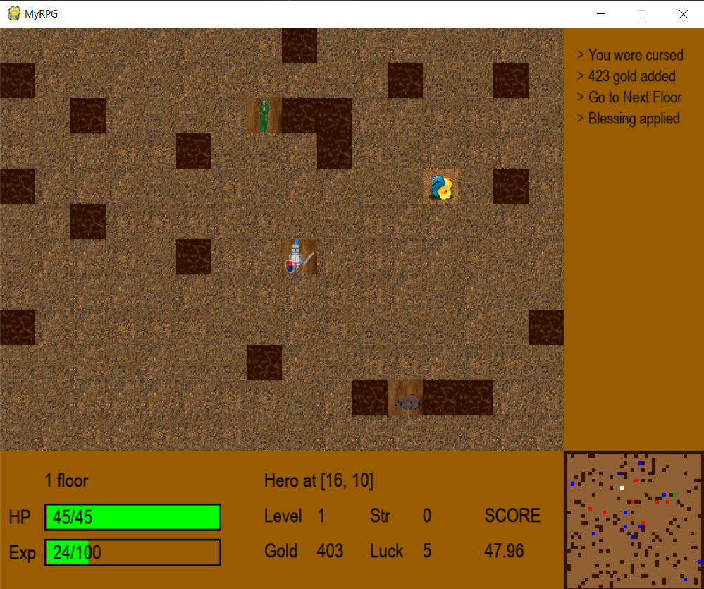

# Dungeon-Knight

### 2D rpg игра на Python - итоговый проект курса "ООП и паттерны проектирования в Python" от coursera.org

```
TODO: мне не нравится, то что у меня получилось,
надуюсь у меня дойдут руки переделать его
```
<p>


</p>